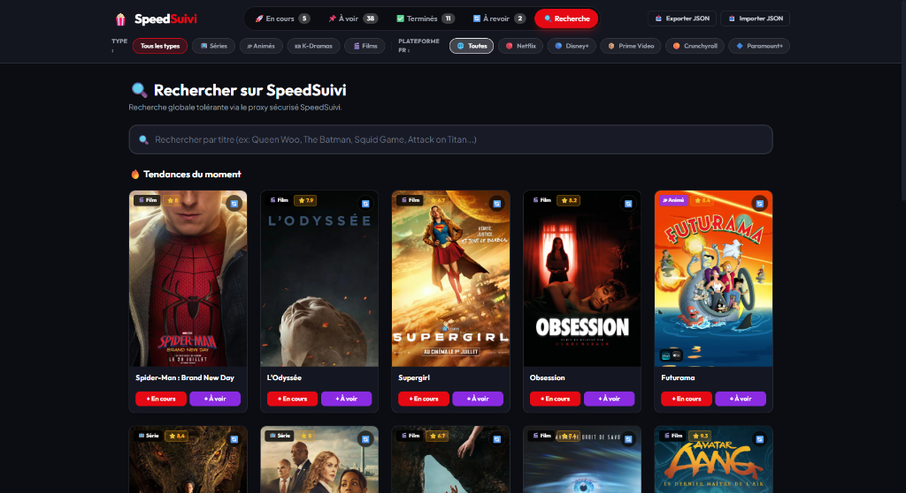

# 🍿 SpeedSuivi - Suivi de Films, Séries, Animés & K-Dramas

🚀 **Application disponible en ligne :** [https://raphdespeed.github.io/SpeedSuivi/](https://raphdespeed.github.io/SpeedSuivi/)

**SpeedSuivi** est une application Web moderne, fluide et réactive conçue pour suivre facilement l'avancement de vos séries, animés, K-Dramas et films préférés.

---

## ✨ Fonctionnalités Principales

- **⚡ Application Web Standalone (100% Statique) :** 
  Déployée sous la forme d'un fichier `index.html` autonome. Aucun serveur ou installation requis : elle s'exécute directement dans n'importe quel navigateur !

- **🔍 Recherche Globale Tolérante :**
  Barre de recherche réactive avec système anti-perte de focus (debounce 300ms) pour trouver instantanément n'importe quel film ou série, même avec des fautes de frappe (*ex: "quenn" trouvera "Queen Woo"*).

- **📊 Dashboard & Gestion du Visionnage :**
  - 🚀 **En cours :** Suivi prioritaire avec boutons d'incrémentation `+` et `-` de l'épisode vu et barre de progression dynamique en pourcentage (%).
  - 📌 **À voir :** Liste d'attente des contenus à découvrir.
  - ✅ **Terminés :** Historique complet des œuvres entièrement visionnées.
  - 🔄 **À revoir :** Section dédiée aux coups de cœur et médias à re-visionner.

- **📺 Plateformes de Streaming en France :**
  Affichage des logos des plateformes de streaming disponibles en France (*Netflix, Disney+, Prime Video, Crunchyroll, Paramount+*) et filtres rapides par plateforme.

- **🇰🇷 Détection Automatique des K-Dramas & Animés :**
  Filtrage précis identifiant automatiquement les K-Dramas coréens et les animés japonais avec des badges de couleur dédiés.

- **🔽 Pagination & Scroll Infini :**
  Chargement dynamique des résultats lors du défilement vers le bas de la page.

- **💡 Fiche Détaillée & Recommandations :**
  Consultez le synopsis, la note ⭐, l'année de sortie, les plateformes disponibles et découvrez une sélection de **Titres similaires et recommandations** au bas de la fiche.

---

## 🚀 Installation & Utilisation

Vous pouvez utiliser l'application de deux manières très simples :

1. **Accès direct en ligne :**
   Rendez-vous simplement sur [https://raphdespeed.github.io/SpeedSuivi/](https://raphdespeed.github.io/SpeedSuivi/).

2. **Utilisation locale :**
   Double-cliquez simplement sur le fichier [`index.html`](index.html) pour ouvrir l'application dans n'importe quel navigateur (Chrome, Firefox, Edge, Safari).

---

## 💾 Gestion & Sauvegarde des Données

SpeedSuivi repose sur une architecture **Zero-Backend** : aucune donnée n'est hébergée ou transmise à un serveur tiers. Vous conservez la propriété et le contrôle absolu de vos informations.

Deux modes d'utilisation sont proposés, au choix de l'utilisateur :

### 1. Synchronisation Cloud (Google Drive) ☁️
* **Sauvegarde automatique :** Vos données sont synchronisées en arrière-plan dans votre espace Google Drive personnel.
* **Isolation et confidentialité :** L'application utilise le périmètre applicatif masqué `appDataFolder`. SpeedSuivi accède uniquement à son propre fichier de suivi et **n'a aucun accès au reste de votre Drive (documents, photos, etc.)**.
* **Usage :** Idéal pour retrouver automatiquement votre progression entre votre PC et votre smartphone.

### 2. Mode Local & Export JSON 📁
* **100 % autonome :** L'application fonctionne intégralement en local dans le navigateur (stockage `localStorage` + PWA hors-ligne).
* **Import / Export manuel :** Vous pouvez exporter à tout moment l'ensemble de votre base de données au format `.json` pour conserver une sauvegarde physique ou la transférer manuellement sur un autre appareil.

---

## 🛠️ Technologies Utilisées

- **HTML5** (Structure sémantique)
- **CSS3 & Tailwind CSS (CDN)** (Design moderne dark mode et effets de verre poli)
- **JavaScript & Vue 3 (CDN Standalone)** (Réactivité dynamique sans build step)

---

© 2026 **SpeedSuivi** - Développé avec passion pour le suivi de médias.
